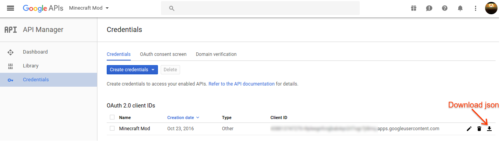
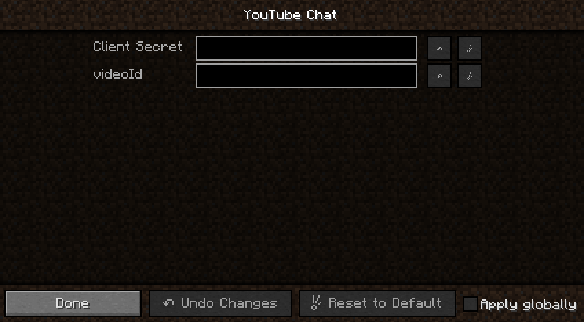

# YouTube Chat for Minecraft

A plugin for Minecraft Forge that provides an API for YouTube live chat
services. This is not an official Google product.

## Features

*  Broadcasts live chat messages to multiple clients from a single network
  connection
*  Provides author details (channelId, displayName, isChatModerator, isChatOwner
   isChatSponser, profileImageUrl) and SuperChat details
*  In-game configuration

## Workspace setup

Clone this repository, and open a terminal to the root directory. Navigate to
[http://files.minecraftforge.net](http://files.minecraftforge.net) and pick
the latest or recommened MDK version. Update the mdkVersion definition in
setup.gradle, then run the installMdk task:

  ```
  ./gradlew -b setup.gradle
  ```

Next, setup the decompiled workspace and save the build dependencies:

  ```
  ./gradlew setupDecompWorkspace
  ./gradlew saveDependencies
  ```

Build the jar:

  ```
  ./gradlew build
  ```

A single .jar file will be output to build/libs, e.g. ytchat-1.0.0.jar.


# Intellij Idea Setup

If you have Intellij Idea installed and plan to use it for development, perform
these steps to setup the project directory.

1. Run the following gradle task:

  ```
  ./gradlew idea
  ```
2.  Open the project folder with Intellij, and import the Gradle project
  when prompted.
3.  Make sure you have the 1.8 JDK configured (*File->Project Structure->SDKs*).
4.  Select *Run->Edit Configurations*:
  * There should be two configurations - *Minecraft Client* and *Minecraft
  Server*.
  * Edit the *Minecraft Client* configuration.
  * Go to the *Use classpath of a module* field
  * Select the module ending with *_main*.
  * Ensure a valid JRE is selected.
5.  Run the *Minecraft Client* configuration. Minecraft should open. You may
 Debug as well.

## Installation

Copy the YouTube Chat jar to one these folders depending on your OS:

* **Linux**: ~/.minecraft/mods
* **OSX**: ~/Library/Application\ Support/minecraft/mods/
* **Windows**: %APPDATA%/Minecraft/mods

## Obtaining Credentials

1.  Create a project in the [Google API Console](https://console.developers.google.com/)

2.  Click *Create credentials*. Select *OAuth client ID* from the dropdown,
followed by *Other* for the Application type.

3.  Open the [API Library](https://console.developers.google.com/apis/library?project=_)
    and ensure that your application is registered to use the YouTube Data API.

4.  Download the json credentials by clicking the following icon for your
  project: 


## Configuration



1.  With YouTube Chat installed, open Minecraft with the forge profile.
2.  At the Minecraft main menu, select *Mods*.
3.  Select *YouTube Chat*, and click *Config*. There are 2 settings:
  *  **Client Secret**: *(Required)* The client secret json downloaded from the
  Google API Console
  *  **videoId**: *(Optional)* A videoId associated with the live broadcast to
  connect to. If blank, will attempt to connect to the signed in user's live
  broadcast *(a Google sign-in dialog will appear when starting YouTube Chat)*.

## Runtime Usage

YouTube Chat supports the following commands in Minecraft:

```
/ytchat [start|stop|logout|echoStart|echoStop]
```
*  **start**: Starts the YouTube Chat service, connecting to the live chat of
the signed in user.
*  **stop**: Stops the YouTube Chat service.
*  **logout**: Stops the YouTube Chat service and clears saved credentials.
*  **echoStart**: Starts echoing chat messages into Minecraft chat,
   for troubleshooting.
*  **echoStop**: Stops echoing chat messages into Minecraft chat.

```
/ytcmock <mock author id/name> <mock input>
```

Provides mock input for testing without a YouTube live chat connection.

## API

To use YouTube Chat, copy the jar into the libs folder of your Forge directory.
Regenerate the project with gradle, or manually add a dependency to the jar in
the project settings.

Add ytchat to the dependencies field in mcmod.info, e.g.:

  ```
  "dependencies": ["ytchat"]
  ```
Get an instance of the [YouTubeChatService](https://github.com/youtube/youtube-chat-for-minecraft/blob/master/src/main/java/com/google/youtube/gaming/chat/YouTubeChatService.java)
interface:

  ```java
  YouTubeChatService service = YouTubeChat.getService();
  ```
## Discussion and Support

Join the discussion group at 
[https://groups.google.com/forum/#!forum/youtube-chat-for-minecraft](https://groups.google.com/forum/#!forum/youtube-chat-for-minecraft)